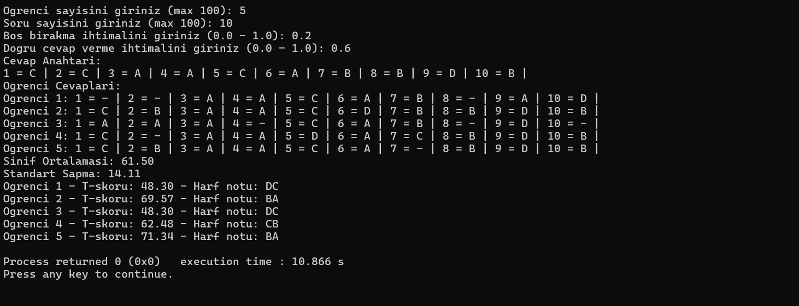

# Öğrenci Sınav Değerlendirme Programı

Bu program, rastgele cevap anahtarı ve öğrenci cevapları oluşturarak bir sınavın değerlendirilmesini sağlar. Program, her öğrenci için puanları hesaplar ve sonuçları T-skoru ve harf notlarına göre değerlendirir.

## Özellikler

- **Rastgele Cevap Anahtarı ve Öğrenci Cevapları Üretme**:  
  Cevap anahtarı ve öğrenci cevapları rastgele oluşturulur. Öğrencilerin doğru, yanlış ve boş cevapları simüle edilir.
  
- **Puanlama Sistemi**:  
  - Her doğru cevap için 100/S puan verilir.
  - Yanlış cevaplar için -25/S puan düşülür.
  - Boş bırakılan sorular için hiçbir puan eklenmez veya düşülmez.

- **Sınıf Ortalaması ve Standart Sapma**:  
  Sınıfın ortalama puanı ve öğrencilerin puanlarının standart sapması hesaplanır.

- **T-Skoru ve Harf Notları**:  
  Öğrencilerin puanlarına göre T-skoru hesaplanır ve harf notları atanır.

## Gereksinimler

- C programlama dili
- `stdlib.h` ve `time.h` kütüphaneleri

## Kullanıcı Girişi

Program, kullanıcıdan aşağıdaki bilgileri alır:

- **Öğrenci Sayısı (N)**: Sınava katılacak öğrenci sayısı.
- **Soru Sayısı (S)**: Sınavdaki soru sayısı.
- **Boş Cevap Verme İhtimali (B)**: Öğrencilerin boş cevap verme oranı.
- **Doğru Cevap Verme İhtimali (D)**: Öğrencilerin doğru cevap verme oranı.

## Çıktılar

1. **Cevap Anahtarı**: Tüm sorular için doğru cevapları içerir.
2. **Öğrenci Cevapları**: Her öğrencinin cevapları, doğru, yanlış veya boş bırakılan sorular ile birlikte listelenir.
3. **Öğrenci Puanları**: Her öğrenci için hesaplanan puanlar.
4. **Sınıf Ortalaması ve Standart Sapma**: Sınıfın genel başarı düzeyi.
5. **T-Skorları ve Harf Notları**: Her öğrencinin T-skoru ve harf notları.

## Kod Açıklamaları

### 1. **cevap_anahtari_uret**

Bu fonksiyon, sınavın cevap anahtarını rastgele oluşturur. Cevap anahtarı, her bir soru için 'A', 'B', 'C' veya 'D' seçeneklerinden birini rastgele seçer.

### 2. **sinavi_uygula**

Bu fonksiyon, öğrencilerin cevaplarını rastgele oluşturur. Her öğrencinin cevapları, doğru, yanlış ve boş olmak üzere üç farklı türde olabilir. Öğrencilerin doğru ve yanlış cevapları, kullanıcı tarafından belirtilen oranlara göre dağıtılır. Boş cevap oranı ise `B` parametresi ile kontrol edilir. Cevaplar, doğru cevaplardan farklı olacak şekilde rastgele belirlenir.

### 3. **ogrencileri_puanla**

Bu fonksiyon, her öğrencinin cevaplarını değerlendirmek için kullanılır. Öğrencinin verdiği her cevabı, cevap anahtarıyla karşılaştırarak doğru, yanlış veya boş bırakılmasına göre puan verir. Doğru cevaplar için puan eklenirken, yanlış cevaplar için puan düşülür. Boş bırakılan sorular için herhangi bir puan eklenmez veya düşülmez.

### 4. **T_skoru_hesapla**

Bu fonksiyon, her öğrencinin T-skorunu hesaplar. T-skoru, öğrencilerin sınav performansını daha standardize bir şekilde değerlendirmek için kullanılır. T-skoru, öğrenci puanının sınıfın ortalama puanına göre ne kadar uzak olduğunu gösterir. T-skorları genellikle 50'ye yakın ve 10'luk bir standart sapmaya sahip olacak şekilde hesaplanır.

### 5. **harf_notu_hesapla**

Bu fonksiyon, öğrencilerin puanlarına göre harf notlarını hesaplar. Puanlara göre belirli aralıklarda harf notları atanır. Örneğin, en yüksek puan aralığına sahip öğrenciler "A" alırken, daha düşük puanlar için "B", "C", "D" gibi notlar atanır. Bu, öğrencilerin başarılarını daha anlaşılır bir şekilde kategorize etmeye yardımcı olur.

### 6. **sinav_degerlendir**

Bu fonksiyon, tüm değerlendirme sürecini birleştiren ana fonksiyondur. İlk olarak, cevap anahtarı ve öğrenci cevapları oluşturulur. Ardından, her öğrencinin puanları hesaplanır, sınıf ortalaması ve standart sapma belirlenir. Son olarak, her öğrencinin T-skoru ve harf notu hesaplanır ve sonuçlar ekrana yazdırılır.

---

## Programın Akışı

1. **Kullanıcı Girişi**: Program, kullanıcıdan sınavla ilgili temel bilgileri alır (öğrenci sayısı, soru sayısı, doğru ve boş cevap oranları).
2. **Cevap Anahtarı Üretimi**: Sınav için rastgele bir cevap anahtarı oluşturulur.
3. **Öğrenci Cevapları Üretimi**: Öğrencilerin cevapları, belirli oranlar dahilinde rastgele oluşturulur.
4. **Puan Hesaplama**: Her öğrencinin puanları hesaplanır.
5. **T-Skoru Hesaplama**: Öğrencilerin T-skorları hesaplanır.
6. **Harf Notu Hesaplama**: Her öğrencinin T-skoruna göre harf notları atanır.
7. **Sonuçların Gösterilmesi**: Öğrencilerin sınav sonuçları (puanlar, T-skorları, harf notları) ekrana yazdırılır.

## Çıktı Örneği

Program çalıştırıldığında aşağıdaki gibi bir çıktı üretilebilir:

  
